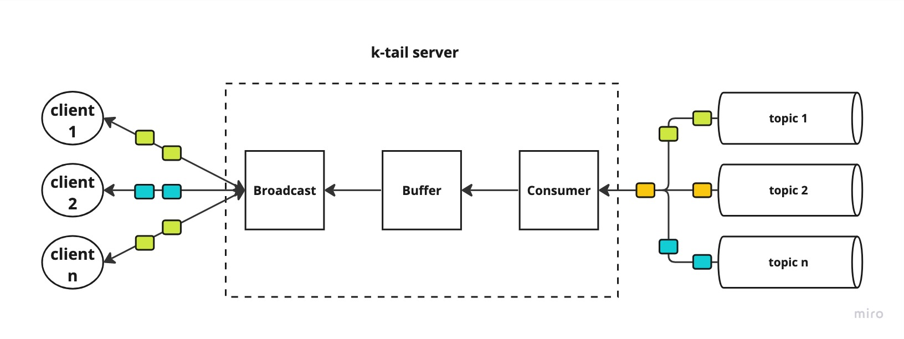

## k-tail

The app is a web socket server for broadcasting kafka messages for some preconfigured topics.
It's built for the educational purpose of a blog post series about programming with _ZIO_
library.  I encourage you to read the posts first.

* Part one, covers basic of _ZIO_ effects, streams and layers - [link](https://softwaremill.com/getting-started-with-zio-part-1/)
* Part two, covers basics of concurrency and web sockets handling - TODO link

### Overview

### Run it

I assume `sbt` is installed on your OS.

1. start Kafka & Zookeeper using provided docker compose file, `docker compose up`
2. Run the dummy producer which will send random messages to test Kafka
   topic, `sbt "project producer" "run"`
3. Run the server with `sbt "project server" "run"`
